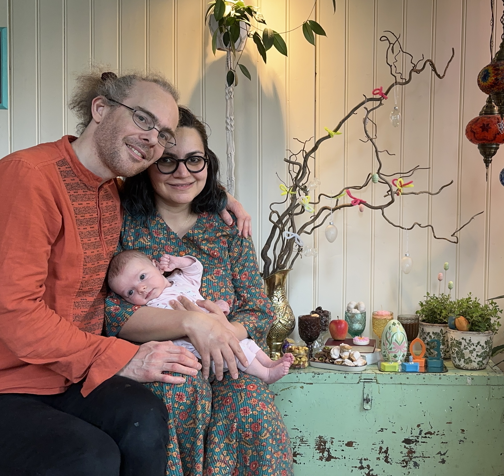

Sagil 1.0
----------

Welcome to the Sagil 1.0 release party! Team Sagil has been working
tirelessly towards this moment for 10 years now, and we are proud to
finally announce the release of Lavinia Iselin Mithra Sagil!

The release party will take place on the weekend 2024-07-19 to
2024-07-21 at
[Hoppeseter](https://www.google.com/maps/place/Hoppeseter/@60.0025649,10.4709019,15.74z/data=!4m6!3m5!1s0x46410de74e788197:0x3f4f61a0db2ffb71!8m2!3d60.0040951!4d10.4708388!16s%2Fg%2F11c554cqnv?entry=ttu)
outside Oslo.

Our release party is beta release friendly! We believe in releasing
early and testing in production! Human models are welcome from as
early releases as 0 years.

# Practical info about the venue (more will be added soon):

## Facilities

* 4 bedrooms
* 35 sleeping spaces
  * 25 of which are actual beds
* Shower
* Sauna
* Fireplace
* A lake to swim in nearby if the weather permits

## What you need to bring

* Sleeping bag
* Swimming clothes if you're up for a swim!
* Debugging tools and powersupplies for any early models you are brining along

## How to get there

The closest bus stop is 5,5km from the hut. There is also a parking lot next to this bus
stop. If it is hard for you to walk this far, coordinate with Team
Sagil to organize transport from there to the upper parking lot, 2.2km
from the hut.

* To get to the bus stop, follow [this public transport route](https://www.google.com/maps/dir/Oslo+S,+Jernbanetorget,+Oslo/Bykrysset,+1350+Lommedalen/@59.9352427,10.529885,12z/data=!3m1!4b1!4m14!4m13!1m5!1m1!1s0x46416e8a1c253d39:0xe77bcdda7048ef3b!2m2!1d10.7520409!2d59.9112239!1m5!1m1!1s0x46411207cede829b:0x984cd6fc4a911655!2m2!1d10.467765!2d59.979366!3e3?entry=ttu)
* To get from the bus stop to the upper parking lot, follow [this route](https://www.openstreetmap.org/directions?engine=fossgis_osrm_foot&route=59.9796%2C10.4676%3B60.0010%2C10.4864#map=14/59.9903/10.4770).
* To get from the upper parking lot to the hut, follow [this route](https://www.openstreetmap.org/directions?engine=fossgis_osrm_foot&route=60.0010%2C10.4863%3B60.0041%2C10.4709#map=16/60.0030/10.4842).

# Signup

Please notify Team Sagil using the form below of your intention to
attend, as well as number of participants and any special needs or
requirements!

We would be very happy for any help with party deployment and tear
down, including decoration, food preparation and transport. If you are
able to help, don't hesitate to indicate this in the form below, or
contact Team Sagil by email at redhog@redhog.org at any time!

<iframe src="https://docs.google.com/forms/d/e/1FAIpQLSemxJsNVSfIVxwV_IHkZNeYHifbZgPybm3SATZ3jQasD6k9tw/viewform?embedded=true" width="100%" height="1700" frameborder="0" marginheight="0" marginwidth="0">Loading…</iframe>
